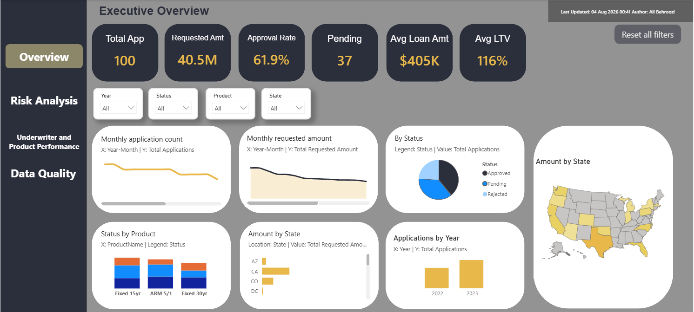
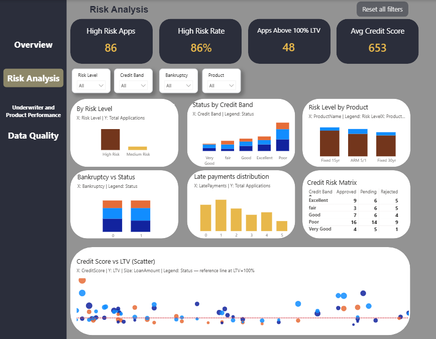
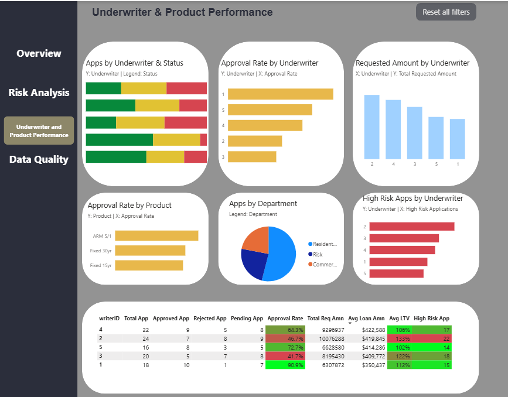
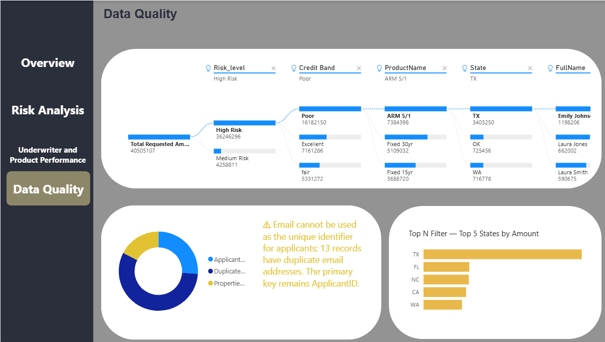

# Mortgage Loan Risk Analysis — Power BI

A comprehensive Power BI dashboard for analyzing mortgage loan applications, approval trends, credit risk, loan-to-value ratios, product performance, underwriter performance, and portfolio exposure.

## Project Overview

This project analyzes mortgage loan applications using Power BI.

The report combines data from six Excel sources:

- Applications
- Applicants
- Credit History
- Loan Products
- Properties
- Underwriters

The project includes:

- Data cleaning and transformation with Power Query
- Star-schema data modeling
- A dedicated date table
- DAX calculated columns and measures
- Loan-to-Value analysis
- Credit-risk segmentation
- Application-status analysis
- Product and underwriter performance analysis
- Business insights and management recommendations

## Dashboard Preview

### Executive Overview



### Risk Analysis



### Underwriter and Product Performance



### Data Model



## Project Objectives

The main objectives of this project are:

- Analyze mortgage application volume and requested loan amounts
- Measure approval, rejection, and pending rates
- Identify high-risk mortgage applications
- Analyze applications with LTV above 100%
- Compare mortgage product performance
- Evaluate underwriter performance
- Analyze credit score, bankruptcy, and late-payment patterns
- Identify major portfolio risks
- Provide practical management recommendations

## Project Structure

```text
mortgage-loan-risk-analysis-powerbi/
│
├── dashboard/
│   └── mortgage_loan_risk_analysis.pbix
│
├── data/
│   ├── Applicants.xlsx
│   ├── Applications.xlsx
│   ├── CreditHistory.xlsx
│   ├── LoanProducts.xlsx
│   ├── Properties.xlsx
│   └── Underwriters.xlsx
│
├── images/
│   ├── executive_overview.png
│   ├── risk_analysis.png
│   ├── underwriter_performance.png
│   └── data_model.png
│
├── docs/
│   ├── data_dictionary.md
│   ├── power_query.md
│   ├── data_model.md
│   ├── dax_calculations.md
│   └── business_insights.md
│
├── README.md
└── LICENSE
```

## Data Sources

The project uses six Excel files.

| Source | Power BI table | Records | Purpose |
|---|---|---:|---|
| Applications.xlsx | FactApplications | 100 | Mortgage application transactions |
| Applicants.xlsx | DimApplicants | 50 | Applicant information |
| CreditHistory.xlsx | CreditHistory | 50 | Credit score and credit-history information |
| LoanProducts.xlsx | DimProducts | 3 | Mortgage product details |
| Properties.xlsx | DimProperties | 50 | Property and appraisal information |
| Underwriters.xlsx | DimUnderwriters | 5 | Underwriter and department information |

## Data Preparation

Data preparation was completed in Power Query.

Main steps included:

- Renaming imported queries
- Correcting data types
- Cleaning and trimming text fields
- Converting email values to lowercase
- Creating a FullName column
- Merging CreditHistory into DimApplicants
- Validating primary keys
- Checking duplicate values
- Checking null values
- Disabling unnecessary query loading

A major data-quality finding was that the Email field contained duplicated values for 13 out of 50 applicants.

Therefore:

```text
ApplicantID is used as the primary applicant key.
Email is not treated as a unique identifier.
```

Detailed Power Query steps are available in:

```text
docs/power_query.md
```

## Data Model

The project uses a star schema.

The central fact table is:

```text
FactApplications
```

Dimension tables include:

```text
DimApplicants
DimProperties
DimProducts
DimUnderwriters
DimDate
```

All model relationships use:

```text
Many-to-One cardinality
Single-direction filtering
```

The star-schema design supports reliable filtering, reusable measures, better performance, and clearer business analysis.

Detailed model documentation is available in:

```text
docs/data_model.md
```

## Date Table

A dedicated date table was created using DAX.

```DAX
DimDate =
VAR MinDate =
    MIN ( FactApplications[ApplicationDate] )

VAR MaxDate =
    MAX ( FactApplications[ApplicationDate] )

RETURN
ADDCOLUMNS (
    CALENDAR ( MinDate, MaxDate ),
    "Year", YEAR ( [Date] ),
    "Quarter", "Q" & QUARTER ( [Date] ),
    "Month", FORMAT ( [Date], "MMMM" ),
    "MonthNumber", MONTH ( [Date] ),
    "Year-Month", FORMAT ( [Date], "YYYY-MM" )
)
```

The Date table supports:

- Monthly trends
- Yearly comparisons
- Quarterly analysis
- Year and month slicers

## Calculated Columns

The project includes four major calculated columns.

### Loan-to-Value Ratio

```DAX
LTV =
DIVIDE (
    FactApplications[LoanAmount],
    RELATED ( DimProperties[AppraisedValue] )
)
```

### LTV Band

```DAX
LTV Band =
SWITCH (
    TRUE(),
    FactApplications[LTV] <= 0.8, "Low",
    FactApplications[LTV] <= 1.0, "Medium",
    "High"
)
```

### Credit Band

```DAX
Credit Band =
SWITCH (
    TRUE(),
    DimApplicants[CreditScore] < 600, "Poor",
    DimApplicants[CreditScore] < 650, "Fair",
    DimApplicants[CreditScore] < 700, "Good",
    DimApplicants[CreditScore] < 750, "Very Good",
    "Excellent"
)
```

### Risk Level

Risk Level is determined using:

- Credit Score
- Bankruptcy history
- Late Payments
- Loan-to-Value ratio

Applications are classified into:

```text
Low Risk
Medium Risk
High Risk
```

All calculated columns and measures are documented in:

```text
docs/dax_calculations.md
```

## Main Measures

The project includes 20 DAX measures, including:

- Total Applications
- Unique Applicants
- Total Requested Amount
- Average Loan Amount
- Approved Applications
- Rejected Applications
- Pending Applications
- Approval Rate
- Rejection Rate
- Pending Rate
- Average LTV
- High Risk Applications
- High Risk Rate
- Average Credit Score
- Applications Above 100% LTV
- Above 100% LTV Rate
- Approved Loan Amount
- Rejected Loan Amount
- Applications per Applicant

## Report Pages

## 1. Executive Overview

This page provides a high-level view of mortgage activity.

Main KPIs include:

- Total Applications
- Total Requested Amount
- Approval Rate
- Pending Applications
- Average Loan Amount
- Average LTV

Visualizations include:

- Monthly application trend
- Monthly requested amount trend
- Applications by Status
- Applications by Product and Status
- Requested amount by State
- Applications by Year

## 2. Risk Analysis

This page focuses on credit and portfolio risk.

Main KPIs include:

- High Risk Applications
- High Risk Rate
- Applications Above 100% LTV
- Average Credit Score

Visualizations include:

- Applications by Risk Level
- Application Status by Credit Band
- Risk Level by Product
- Application Status by Bankruptcy
- Applications by Late Payments
- Credit-risk matrix
- Credit Score versus LTV scatter plot

## 3. Underwriter and Product Performance

This page compares underwriter and mortgage product performance.

Visualizations include:

- Applications by Underwriter and Status
- Approval Rate by Underwriter
- Requested Amount by Underwriter
- Approval Rate by Product
- Applications by Department
- High Risk Applications by Underwriter
- Underwriter performance matrix

## Key Business Insights

### Application Growth

Mortgage applications increased from:

```text
42 applications in 2022
```

to:

```text
58 applications in 2023
```

This represents approximately:

```text
38% growth
```

### Requested Amount Growth

Total requested loan value increased from:

```text
$16,621,984 in 2022
```

to:

```text
$23,883,123 in 2023
```

This represents approximately:

```text
44% growth
```

### Highest Product Approval Rate

The `5/1 ARM` product had the highest approval rate:

```text
Approximately 70%
```

### Highest Underwriter Approval Rate

`Underwriter 1` achieved an approval rate of approximately:

```text
91%
```

### Highest Geographic Exposure

Texas had the highest total requested loan amount:

```text
Approximately $13.3 million
```

### Main Portfolio Risk

A total of:

```text
48 out of 100 applications
```

had an LTV above 100%.

Of these applications:

```text
24 were still Pending
15 were Approved
9 were Rejected
```

The most important insight is:

```text
48% of all applications have an LTV above 100%,
and 24 of these applications are still pending.
```

### Product Requiring Further Review

The `Fixed 15yr` product had:

- The highest application volume
- The highest total requested amount
- The lowest approval rate among the three products

This makes it an important product for further investigation.

Detailed findings are available in:

```text
docs/business_insights.md
```

## Management Recommendations

### 1. Prioritize Pending High-LTV Applications

The 24 pending applications with LTV above 100% should receive priority review.

Suggested actions:

- Add escalation rules
- Assign review deadlines
- Track pending-case age
- Review documentation gaps
- Monitor weekly resolution progress

### 2. Standardize Underwriter Decision Criteria

Approval rates vary significantly across underwriters.

Management should:

- Review case assignment
- Compare risk-adjusted approval rates
- Conduct decision-calibration sessions
- Audit approved and rejected applications
- Standardize underwriting checklists

### 3. Review the Fixed 15yr Product

The Fixed 15yr product should be reviewed because it combines high demand with a relatively low approval rate.

Potential areas for review include:

- Eligibility requirements
- Applicant risk profile
- Average LTV
- Pricing
- Documentation requirements
- Alternative product recommendations

## Tools and Technologies

- Power BI Desktop
- Power Query
- DAX
- Excel
- Star Schema
- Data Modeling
- Business Intelligence
- Financial Analytics
- Risk Analysis
- Data Visualization

## Skills Demonstrated

This project demonstrates experience in:

- Data cleaning
- Data transformation
- Data modeling
- Power Query M
- DAX calculated columns
- DAX measures
- KPI development
- Dashboard design
- Financial risk analysis
- Business insight generation
- Management recommendation development
- Data-quality assessment

## How to Open the Project

1. Download the Power BI file:

```text
dashboard/mortgage_loan_risk_analysis.pbix
```

2. Open the file using Power BI Desktop.

3. Review the following report pages:

```text
Executive Overview
Risk Analysis
Underwriter and Product Performance
```

4. Use the report slicers to filter by:

```text
Year
State
Product
Status
Risk Level
Credit Band
Bankruptcy
Underwriter
```

## Documentation

Additional project documentation is available here:

| Document | Description |
|---|---|
| `docs/data_dictionary.md` | Tables, fields, data types, and data-quality notes |
| `docs/power_query.md` | Power Query cleaning and transformation steps |
| `docs/data_model.md` | Star schema and relationship design |
| `docs/dax_calculations.md` | DAX date table, columns, and measures |
| `docs/business_insights.md` | Analytical findings and recommendations |

## Limitations

The project has several limitations:

- The dataset contains only 100 applications.
- The Risk Level is a rule-based dashboard classification.
- The dashboard does not represent a production credit-scoring system.
- Pending applications do not yet have final outcomes.
- Underwriter performance is not adjusted for case complexity.
- The data does not include income or debt-to-income ratio.
- The data does not include repayment or default outcomes.
- Small groups may produce unstable percentages.

## Future Improvements

Future development may include:

- Pending-case aging analysis
- Application processing-time analysis
- Risk-adjusted underwriter comparison
- Loan default prediction
- Debt-to-income analysis
- Applicant income analysis
- Portfolio stress testing
- Geographic concentration analysis
- Product profitability analysis
- Drill-through applicant profiles
- Automated data refresh
- Row-level security
- Power BI Service publication
- Automated risk alerts

## Author

**Ali Behroozi**

Transportation Engineer and Data Science Researcher with interests in:

- Data analytics
- Business intelligence
- Power BI
- Financial analytics
- Risk analysis
- Machine learning
- Transportation data science

## License

This project is available under the MIT License.
